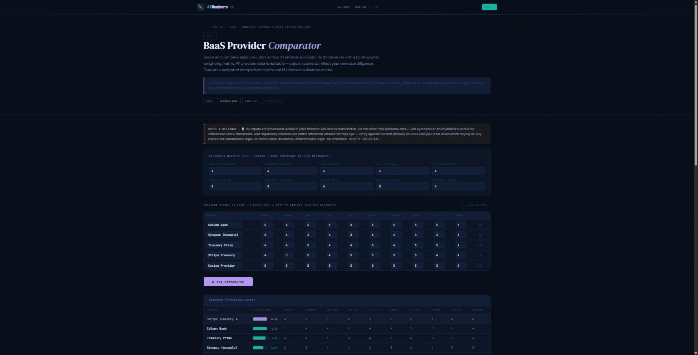

# AINumbers MCP Apps Server

[](https://github.com/PostOakLabs/ainumbers-mcp-apps/actions/workflows/ci.yml)
[](LICENSE)

An agent calling a fintech tool by name has no way to know if the tool actually ran the math it claims to have run. This server closes that gap for the AINumbers.co suite: every tool call is deterministic, zero PII, and served straight from the suite's own single-file HTML, not a paraphrase of it.

An [MCP Apps](https://blog.modelcontextprotocol.io/posts/2026-01-26-mcp-apps/) (SEP-1865) server that exposes the [AINumbers.co](https://ainumbers.co) fintech tool suite to any MCP host, including Claude, ChatGPT, M365 Copilot, VS Code, and Cursor.



## Quick start

```bash
# Claude: Settings -> Connectors -> Add custom connector
https://mcp.ainumbers.co/mcp

# Inspector
npx @modelcontextprotocol/inspector   # then Streamable HTTP -> the URL above
```

No auth, no API key, no account. Production runs on Cloudflare Workers (`/healthz` reports `runtime: cloudflare-workers`), so there are no cold starts. Cursor and other Open Plugins directories pick this repo up automatically via the root `.mcp.json`, which declares the same endpoint.

**Live endpoint:** `https://mcp.ainumbers.co/mcp` (streamable HTTP) · **Docs:** [ainumbers.co/mcp.html](https://ainumbers.co/mcp.html) · **Registry:** [`co.ainumbers/tools`](https://registry.modelcontextprotocol.io/v0.1/servers?search=co.ainumbers) on the Official MCP Registry

## Tools

**Read-only MCP tools** — count intentionally not hardcoded here (it drifted stale the last time it was). See `data/counts.json` for the live figure; never hand-type this number, `scripts/surface-parity.mjs` and the site repo's count-drift gate both check against it. Fifteen tools render as interactive widgets, the rest are ChainGraph compute nodes plus a handful of catalog and discovery utility tools: `list_ainumbers_tools`, `find_tool`, `find_chain`, `build_workflow_links`, `run_chain`, `verify_execution_hash`, `build_chaingraph`, `emit_chaingraph_artifact`, `build_session_receipt`.

Every tool declares `readOnlyHint: true`. No account, no auth, zero PII, nothing mutates state.

### The 15 flagship widgets

Each renders as the actual single-file AINumbers tool, served as a `text/html;profile=mcp-app` resource and driven by the AIN Bridge (prefill, run, Policy Mandate export):

| MCP tool | AINumbers tool |
|---|---|
| `baas_provider_comparator` | T152 BaaS Provider Comparator |
| `validate_ap2_mcp_policy` | T320 AP2 MCP Policy Validator & Bridge |
| `build_google_ap2_mandate` | T285 Google AP2 Checkout/Payment Mandate Builder |
| `score_mcp_readiness` | T288 MCP Developer Readiness Scorecard |
| `agentic_mandate_sandbox` | RBE-06 Agentic Mandate Sandbox |
| `customer_risk_rating` | T110 Customer Risk Rating Engine |
| `ap2_aml_mandate_builder` | T131 AP2 AML Mandate Builder |
| `lint_mcp_tool_definition` | T274 MCP Tool-Definition Linter |
| `validate_mcp_server_json` | T275 MCP server.json Validator |
| `compare_agentic_payment_protocols` | T276 Agentic Payments Protocol Comparator |
| `decode_x402_payment` | T277 x402 Decoder & 402 Flow Simulator |
| `audit_mcp_oauth` | T278 MCP OAuth 2.1 Authorization Auditor |
| `scan_tool_poisoning` | T282 MCP Tool-Poisoning Scanner |
| `validate_a2a_agent_card` | T283 A2A Agent Card Validator |
| `inspect_visa_tap_signature` | T286 Visa TAP Signature Inspector |

`list_ainumbers_tools` and `find_tool` search the full catalog (see `data/counts.json` for the current tool count) and return deep-links. Prefill-enabled tools accept `#in=<base64url(JSON of {element_id: value})>[&run=1]` for one-click invocation. `find_chain` and `build_workflow_links` return ordered deep-links for a named multi-tool workflow. `run_chain` executes one server-side. `verify_execution_hash` independently re-verifies a returned artifact's hash.

## Architecture

```
../repo (site repo, PostOakLabs/ainumbers)
   |  chaingraph.json, manifests/, pilot.mjs-referenced tool HTML
   |
   v  node generate.mjs (build-time only, cannot run in cloud CI, needs the sibling repo)
data/       vendored: chaingraph.json, catalog.json, manifests, counts.json
kernels/    vendored: server-side compute kernels
   |
   v
worker.mjs  (Cloudflare Workers, this repo's live runtime)
server.mjs  (Node/express variant, local dev only, not deployed)
   |
   v
https://mcp.ainumbers.co/mcp   (the one live endpoint: the Worker, not the express variant)
```

`data/` and `kernels/` are generated, committed artifacts. The Worker boots from what's committed, not from a live read of `../repo`. Any change to `chaingraph.json`, a manifest, `pilot.mjs`, or a kernel in the site repo requires re-running `generate.mjs` here and committing `data/` and `kernels/` in the same push, or the worker deploys stale.

## Deploy flow (CI-owned)

Branch, then PR. CI runs the `validate` job: tool-name collisions, surface-parity, kernel coverage, chain validation, vendor-freshness, and a `wrangler deploy --dry-run`. Merging to `master` runs the `deploy` job, which runs `wrangler deploy` against Cloudflare Workers, then a post-deploy `/mcp` smoke test (a real `initialize` call against the live endpoint). No manual `wrangler deploy`, ever: Cloudflare Workers Builds stays disconnected on purpose, since running both is a double-deployer and has caused outages before. A green CI bundle does not by itself prove the live handshake works; only the smoke step does.

Dependabot auto-merges every dependency update (patch, minor, and major, all CI-gated), so run `git pull --rebase` before pushing any local branch since `master` moves on its own.

## Develop

```bash
npm install
node generate.mjs   # re-vendor tool HTML + manifests + catalog + kernels from ../repo into data/ + kernels/
npm start           # http://localhost:3300/mcp (+ /healthz), Node/express variant (server.mjs), local dev only
node scripts/check-tool-names.mjs   # verify no mcp_name collision before pushing
node scripts/surface-parity.mjs     # verify counts.json matches the registered surface
```

`pilot.mjs` is the single source of truth for the widget tool set. After changing any pilot tool in the site repo, run `node generate.mjs`, commit `data/` and `kernels/`, and push. CI validates and deploys.

All tool content is client-side, deterministic, and zero PII. Code is MIT licensed (see `LICENSE`); content is CC BY 4.0, Post Oak Labs. See `README-SPEC.md` for architecture and history.
